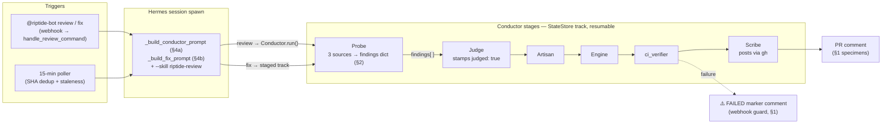

# Data, Prompts, and Real Examples

Everything here is verified against the code at merge `8be3cb5` (PR #230). If this
file and the code disagree, the code wins — fix this file in the same PR as the code.

Companion specs: `docs/REVIEW-CONTRACT.md` (comment markers, CI gate), `docs/TRIGGERS-AND-STOPPING.md`
(identifiers, thresholds, stopping conditions). This doc covers what those two don't:
**the data shapes passed between stages, the actual prompt texts, the GitHub API calls,
and real PR artifacts exemplifying all of it.**

---

## 0. The pipeline in one diagram



Every box links to a section below with its data contract.

---

## 1. Real specimens (every artifact type, with links)

| Artifact | Real example | What to look at |
|---|---|---|
| Findings review (🔴/🟡 table) | [#227 comment 6009454834](https://github.com/ChonSong/riptide/pull/227#issuecomment-6009454834) | `## Review:` header, numbered findings, severity table, `Riptide Review ·` sign-off — the shape the CI gate matches |
| Clean re-review (fix verified) | [#226 comment 6027933342](https://github.com/ChonSong/riptide/pull/226#issuecomment-6027933342) | Verdict referencing exact head SHA; findings from the previous review re-verified, not re-pasted |
| Pass-only review (no findings) | [#230 comment 6029494352](https://github.com/ChonSong/riptide/pull/230#issuecomment-6029494352) | `## Review: ✅ No findings` + sign-off — still a *review* for gate purposes |
| Deterministic pass (NOT a review) | any docs-only PR, e.g. via `companion.py` | `## Riptide Pass: ✅ No findings` byte-exact line 0; states what ran, evidence, why no deep review — see REVIEW-CONTRACT §1a |
| Fix run report (per-finding verdicts) | [#214 comment 6028133295](https://github.com/ChonSong/riptide/pull/214#issuecomment-6028133295) | Multi-source findings consumed (Riptide + CodeRabbit), 6 verdicts with evidence, test results, commit SHA, attribution footer |
| Trigger acks | [#230](https://github.com/ChonSong/riptide/pull/230#issuecomment-6029455819) `🧠 Riptide Review triggered` / [#214](https://github.com/ChonSong/riptide/pull/214#issuecomment-6027663103) `🛠 Riptide Fix triggered` | Name the spawned cron job — chase with `hermes cron list` |
| Failure report | any PR whose review job 402'd, e.g. the 2026-10-05 #214 case | `⚠️ Riptide review job FAILED: <job> (<last_run_at>)` — marker is the webhook self-trigger guard; body never contains the literal command phrase |

---

## 2. The findings dict — the pipeline's central data shape

`Probe._get_review_findings()` (`riptide/pipeline/probe.py`) produces the list every
downstream stage (judge, artisan, engine, fix sessions) consumes:

```python
{
    "source":   "riptide-review" | "coderabbitai" | "human",   # comma-joined when merged
    "severity": "🔴" | "🟡",
    "file":     "riptide/foo.py" | None,      # None = fileless finding (valid, gate shape)
    "line":     int | None,
    "body":     str,                          # ≤300 chars; reply threads merged with " | reply: ..."
}
```

Rules the code enforces that are easy to regress (each was a real bug, fixed in #230):

- **Dedupe key = (file, line, normalized body).** Keying on location alone collapsed
  distinct findings — and when `line` was unassigned, everything keyed `(None, None)`
  and only one finding survived. True cross-source duplicates merge (sources join);
  distinct findings survive.
- **Reply chains collapse into their root's body** (prefix `| reply: `), so a reply
  adding a distinct issue still reaches the fix pipeline. Orphaned replies (root not
  parsed) are emitted standalone.
- **Fileless severity rows** (`| 🟡 | title | — |`) are a shape the review gate itself
  documents; the parser emits them with `file: None` rather than dropping the row.
- **Cap:** 15 findings, truncation annotated on the last *kept* row.
- **`judged: true` gates posting.** Only a payload the judge stamped may render as a
  review; an empty result must never render as a clean pass.

---

## 3. Cron-store projection — fields riptide reads from `~/.hermes/cron/jobs.json`

`deepthink._cron_job_states()` projects **exactly these fields** per job:

```json
{
  "state":       "pending | completed | ...",
  "last_status": "ok | error | ...",
  "enabled":     true,
  "run_at":      "<schedule.run_at> — identifies THIS attempt's job",
  "last_run_at": "<set by the scheduler after each run>"
}
```

`last_run_at` feeds the failure-report marker and its per-run dedup. Dropping it from
the projection silently degraded dedup to once-per-job-name forever (fixed 2026-10-07,
PR #226). If you add a field here, check both consumers: `_job_already_scheduled()` and
`_post_failure_comment()`.

---

## 4. The real prompt texts

### 4a. Review session — `_build_conductor_prompt` (`deepthink.py`)

The poller/webhook spawn gets this. It is deliberately thin: the procedure lives in the
Conductor, not the prompt.

```markdown
Run the Riptide Conductor pipeline to review PR #<n> in <owner>/<repo>.

## PR Context
- Title: <title>
- Author: <author>
- HEAD SHA: <sha12>
- Total LOC changed: <loc>
[## Pre-computed Analysis           ← only when deterministic probe ran
Verdict: <v> — <k> finding(s). Confirm, refute, or extend these in your review.]

## Task
1. Import and instantiate the Conductor for track "riptide-review-<owner>-<repo>-<n>":
   from riptide.pipeline.conductor import Conductor
   conductor = Conductor("riptide-review-<owner>-<repo>-<n>")
   result = conductor.run()
2. The Conductor will dispatch workers: Probe → Judge → Artisan → Engine → Scribe.
3. The Scribe posts the final review to the PR.

[--diagram-url '<url>']             ← when graphify produced one
REPO PATH: ~/workspace/<repo>/
```

The session's real instructions come from `--skill riptide-review` (§XI defines the
verification protocol: the session's job is to make what the Scribe posts *true*, not to
forward the pipeline's verdict). Model/provider are threaded explicitly — spawned
sessions do **not** inherit `.env`.

### 4b. Fix session — `_build_fix_prompt` (`fixer.py`)

Mission statement pointing at the StateStore track staged by `create_fix_pipeline`
(probe → judge → artisan → engine → ci_verifier → scribe). Key contracts inside it:

```markdown
## Mission
Fix ALL outstanding findings from the latest @riptide-bot review on this PR.
   [or: Fix ONLY the problem described here: <description>]

PR: #<n> in <owner>/<repo> — "<title>" by @<author> · HEAD <sha12> (branch: <ref>) · <loc> LOC

Track <track_id>: run the staged workstreams in order — probe, judge, artisan,
engine, ci_verifier, scribe. Each stage's acceptance criteria gate the next;
StateStore work-state.json tracks progress and a killed session resumes at the
failed stage.

Findings (from all reviewers — Riptide, CodeRabbit, human) are in the probe
stage's review_findings output. Verify each against the current code before
editing: valid / skip-already-addressed / skip-stale-false-positive, with one
line of evidence each.

## Rules
Only files in this PR's diff. NEVER edit github-private-key.pem, .env, or any
credential/secret file. Run the repo's tests before pushing — No push on red
tests. Conventional Commits (fix(scope): ...). NO force-push.
[Push rules: authorized → add only edited files, push to PR branch;
 NOT authorized → post the patch as a comment, never stay silent]

Post a summary comment: per-finding verdict + one-line reason, files touched,
test results, commit SHA. Attribution footer REQUIRED, exact string:
<sub>🤖 Riptide Fix via Hermes · model: <model> · provider: <provider></sub>

Cleanup: the scribe workstream handles StateStore mark_complete/mark_failed
for job <job_id> — do not run StateStore calls manually.
```

The W3 run on #214 (specimen table above) is this prompt executed end-to-end —
including the resume contract when sessions die mid-track.

### 4c. Inline small-LLM prompts (`companion.py`, `labeler.py`)

Companion's TLDR / explain-like-I'm-5 one-liners and the labeler's JSON-only
classification prompt live next to their callers (`companion.py:1059`, `:1087`;
`labeler.py:37`). They are one-shot, deterministic-parsing prompts: the output format
is part of the contract (e.g. "Return ONLY a JSON array of label names").

---

## 5. GitHub API surface — what each bot actually calls

All via `gh api` / `gh pr` (CLI-authenticated as ChonSong; no App token needed for reads
in these paths):

| Caller | Endpoint | Shape consumed |
|---|---|---|
| `probe._get_review_findings` | `GET /repos/{o}/{r}/pulls/{n}/reviews` (`--paginate`) | `user.login`, `body`, `state` |
| | `GET /repos/{o}/{r}/issues/{n}/comments` (`--paginate`) | Riptide severity-table rows; ack/failure-marker skip rules |
| | `GET /repos/{o}/{r}/pulls/{n}/comments` (`--paginate`) | inline comments: `body`, `path`, `line`, `in_reply_to_id`, `id` (reply→root merge key) |
| `probe` diff/files | `GET /repos/{o}/{r}/pulls/{n}/files` | `filename`, `additions`, `deletions` (**capped at 300 entries, not paginated** — a larger commit can lose filenames past the cap) |
| `deepthink` poller | `gh pr list/view`, issue comments | PR state, last-comment routing |
| `webhook` | `POST /github/webhook` (App) → `handle_issue_comment` | routes `@riptide-bot` commands; self-filters bot comments + the failure-report marker |
| scribe/fixer | `gh pr comment`, `gh api repos/...` | posting reviews, fix reports, failure reports |

Shape traps that have bitten: `path`/`line` live on *inline* comments only (review
bodies have neither); `in_reply_to_id` is the only parent link; a 300-file commit
silently truncates the `files` array.

---

## 6. Verifying this doc against the code

```bash
git log --oneline -1                      # note the HEAD sha this doc claims
grep -n "_dedupe_key\|_cr_comment_id" riptide/pipeline/probe.py     # §2
grep -n -A10 "states\[name\] = {" riptide/deepthink.py              # §3
grep -n "def _build_conductor_prompt\|def _build_fix_prompt" riptide/deepthink.py riptide/fixer.py  # §4
gh api repos/ChonSong/riptide/pull/214/comments --jq '.[].id'       # §1 links still resolve
```

If a section drifted, the fix is a one-PR edit to this file — the doc's job is to make
drift *visible*, not impossible.
